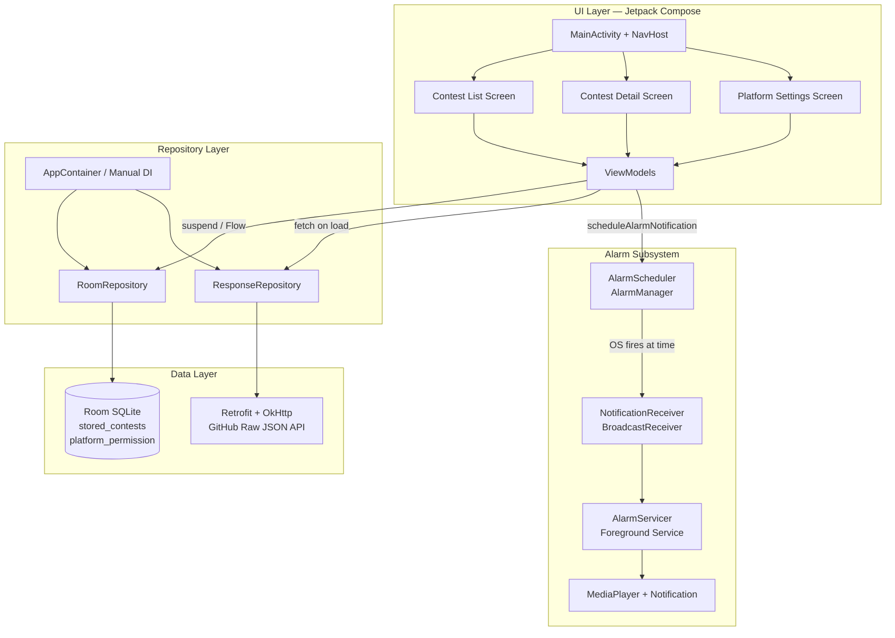
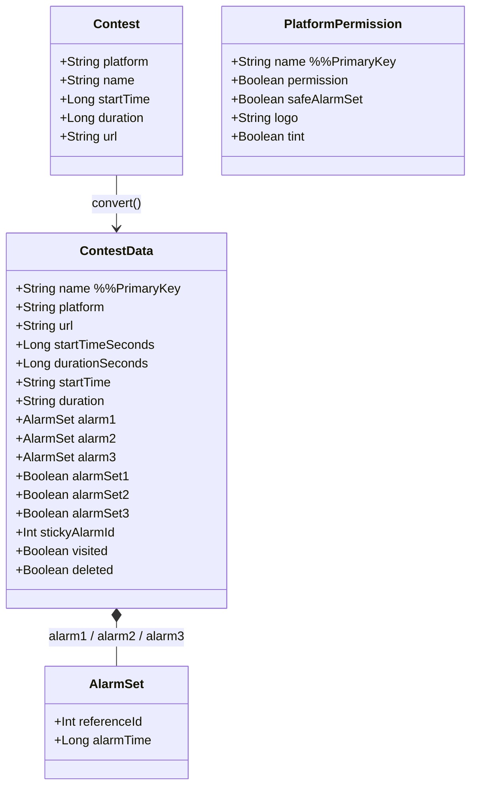
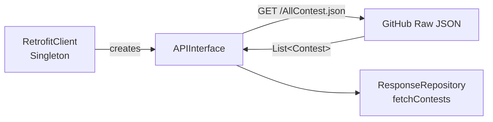
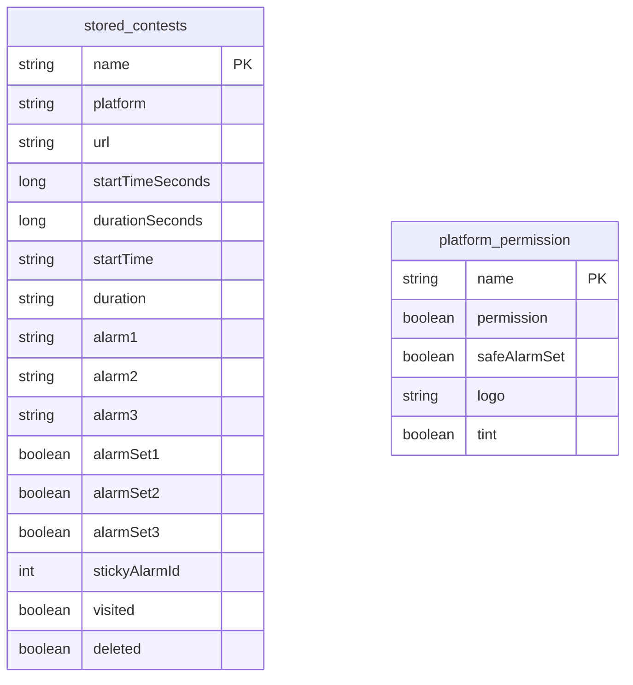
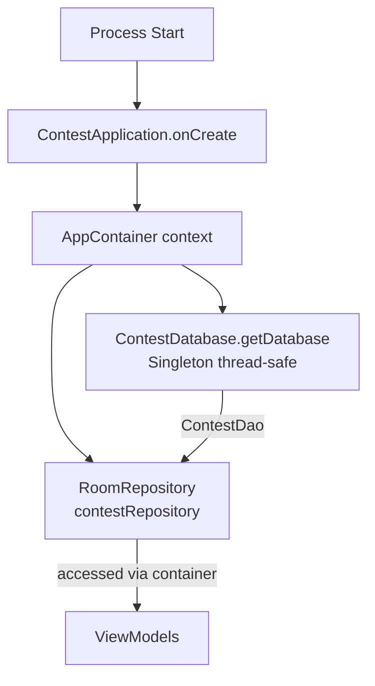
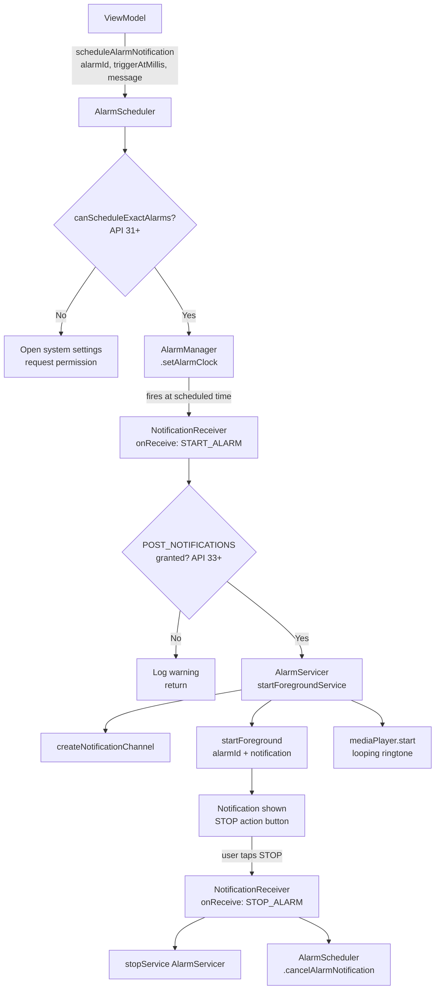
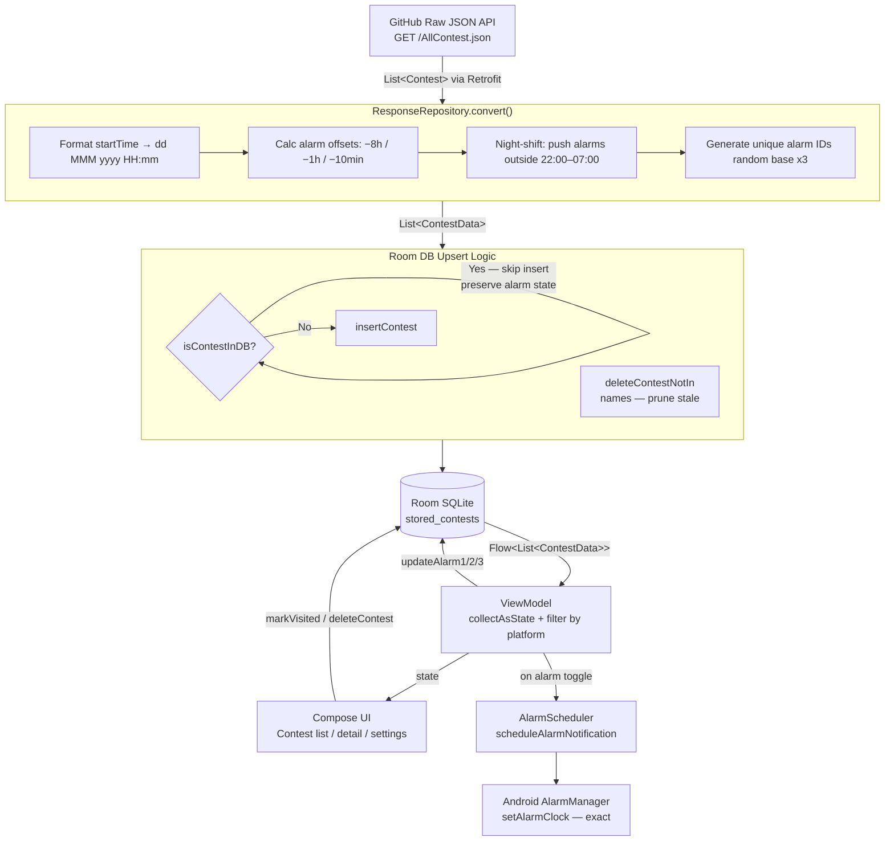
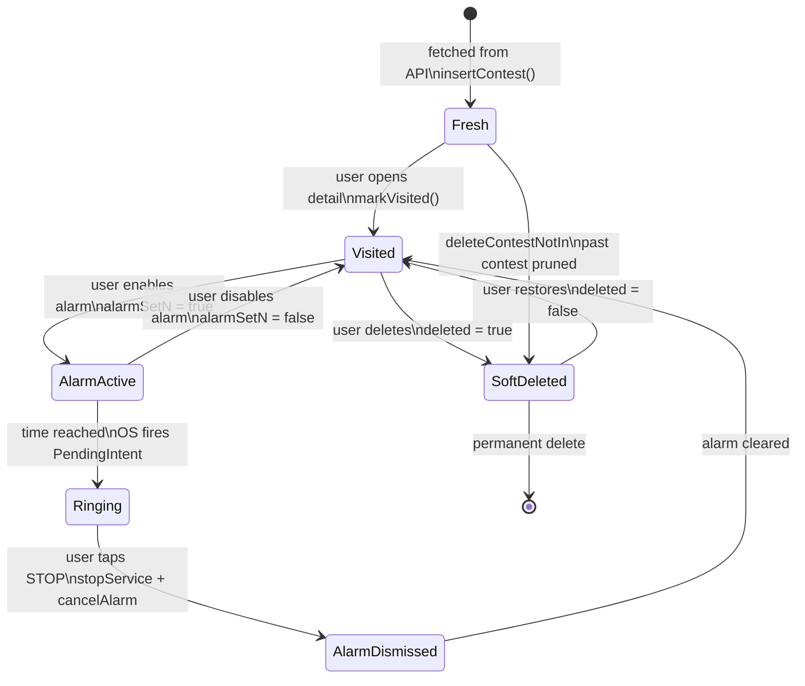
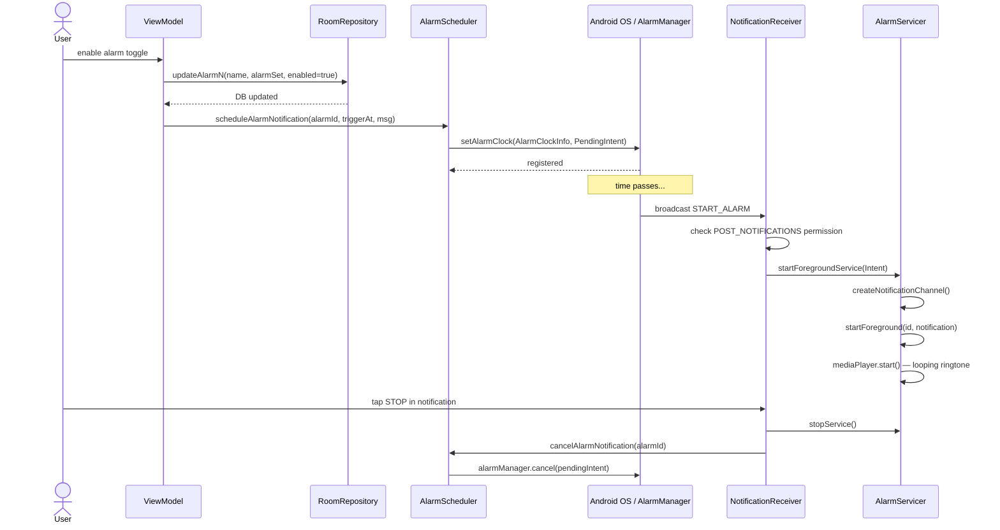

# ContestCaller — Architecture Documentation

> A deep-dive reference covering **app architecture**, **data flow**, and **state flow** for setting up, understanding, and extending the ContestCaller Android app.

---

## Table of Contents

1. [App Overview](#1-app-overview)
2. [Tech Stack](#2-tech-stack)
3. [Project Structure](#3-project-structure)
4. [High-Level Architecture Diagram](#4-high-level-architecture-diagram)
5. [Layer-by-Layer Breakdown](#5-layer-by-layer-breakdown)
   - 5.1 [Data Models](#51-data-models)
   - 5.2 [Network Layer (Retrofit)](#52-network-layer-retrofit)
   - 5.3 [Local Database (Room)](#53-local-database-room)
   - 5.4 [Repository Layer](#54-repository-layer)
   - 5.5 [Dependency Injection Container](#55-dependency-injection-container)
   - 5.6 [Alarm Subsystem](#56-alarm-subsystem)
6. [Data Flow Diagram](#6-data-flow-diagram)
7. [State Flow Diagram](#7-state-flow-diagram)
8. [Alarm Lifecycle Diagram](#8-alarm-lifecycle-diagram)
9. [Android Manifest & Permissions](#9-android-manifest--permissions)
10. [Setup Guide](#10-setup-guide)
11. [Key Design Decisions](#11-key-design-decisions)
12. [Known Issues & Gotchas](#12-known-issues--gotchas)

---

## 1. App Overview

**ContestCaller** is an Android app that:

- Fetches upcoming **competitive programming contests** from a remote JSON API (GitHub raw content).
- Stores them **locally in a Room SQLite database** for offline access.
- Lets users set up to **3 alarms per contest** (8 hours before, 1 hour before, 10 minutes before).
- Fires those alarms using the Android `AlarmManager`, plays a ringtone via a **Foreground Service**, and shows a persistent notification.
- Lets users **filter contests by platform** (Codeforces, LeetCode, etc.) and tracks visited/deleted contests.

---

## 2. Tech Stack

| Concern | Library / Tool |
|---|---|
| Language | Kotlin |
| UI Toolkit | Jetpack Compose + Material 3 |
| Navigation | Navigation Compose |
| Networking | Retrofit 3 + OkHttp 5 + Gson |
| Local DB | Room 2.8 (SQLite) |
| Image Loading | Coil 2.7 (SVG support) |
| Background Tasks | AlarmManager + Foreground Service |
| DI | Manual DI via `AppContainer` |
| Coroutines | Kotlin Coroutines + Flow |
| Serialization | kotlinx.serialization |
| Min SDK | API 26 (Android 8.0 Oreo) |
| Target SDK | API 36 |

---

## 3. Project Structure

```
com.example.contest3/
│
├── Alarm/
│   ├── AlarmReciever.kt        ← BroadcastReceiver: handles START/STOP alarm intents
│   ├── AlarmScheduler.kt       ← Wraps AlarmManager; schedules & cancels exact alarms
│   └── AlarmServicer.kt        ← Foreground Service: plays ringtone, shows notification
│
├── Container/
│   ├── AppContainer.kt         ← Manual DI container (DB + Repository)
│   └── ContestApplication.kt   ← Application class; initialises AppContainer on boot
│
├── Data/
│   ├── ContestData.kt          ← All data model classes (Contest, ContestData, AlarmSet, PlatformPermission)
│   │
│   ├── Api/
│   │   ├── ContestApiService.kt ← Retrofit interface (GET /AllContest.json)
│   │   └── RetrofitClient.kt    ← Singleton Retrofit instance
│   │
│   ├── Reposistory/
│   │   ├── ResponseRepository.kt ← Fetches from network & converts to ContestData
│   │   └── RoomRepository.kt     ← All DB read/write operations (wraps DAO)
│   │
│   └── Room/
│       ├── ContestDataBase.kt   ← Room DB singleton (v4); 2 entities
│       ├── ProjectDao.kt        ← DAO interface (queries & mutations)
│       └── AlarmConverter.kt    ← TypeConverter: AlarmSet ↔ String for SQLite
│
└── MainActivity.kt              ← Entry point; hosts Compose NavHost
```

---

## 4. High-Level Architecture Diagram



---

## 5. Layer-by-Layer Breakdown

### 5.1 Data Models

**File:** `Data/ContestData.kt`



---

### 5.2 Network Layer (Retrofit)

**Files:** `Data/Api/RetrofitClient.kt`, `Data/Api/ContestApiService.kt`



- Single endpoint — returns a flat JSON array of all upcoming contests.
- Gson automatically deserialises the response into `List<Contest>`.
- Called from `ResponseRepository.fetchContests()` inside a coroutine.

---

### 5.3 Local Database (Room)

**Files:** `Data/Room/ContestDataBase.kt`, `Data/Room/ProjectDao.kt`, `Data/Room/AlarmConverter.kt`



---

### 5.4 Repository Layer

**Files:** `Data/Reposistory/RoomRepository.kt`, `Data/Reposistory/ResponseRepository.kt`

```
ResponseRepository
  fetchContests()
    │
    ├─► RetrofitClient.api.getContests()  [network]
    │        returns List<Contest>
    │
    └─► convert(response)
          For each Contest:
            ─ Generate unique alarm IDs (random base, x3 per contest)
            ─ Calculate alarm times (adjustedDuration):
                alarm1 = startTime − 8 hours  (28800s)
                alarm2 = startTime − 1 hour   (3600s)
                alarm3 = startTime − 10 mins  (600s)
            ─ Adjust alarms that fall in "night hours" (22:00–07:00)
              to avoid waking users at night
            ─ Format startTime & duration as human-readable strings
          returns List<ContestData>

RoomRepository
  Thin wrapper around ContestDao.
  All methods delegate directly to the DAO.
  Returns Flow<> for reactive UI observation.
```

**Night-time alarm adjustment logic:**
```
If calculated alarm time falls between 22:00 and 07:00:
  ─ If contest itself is at night → push alarm to previous 22:00
  ─ If contest is daytime        → push alarm to 07:00 of contest day
This prevents alarms waking users in the middle of the night.
```

---

### 5.5 Dependency Injection Container

**Files:** `Container/AppContainer.kt`, `Container/ContestApplication.kt`



> Note: `ResponseRepository` is stateless (no constructor params) and can be instantiated wherever needed. It is NOT wired through `AppContainer` — ViewModels or use-cases that need it create it directly.

---

### 5.6 Alarm Subsystem

**Files:** `Alarm/AlarmScheduler.kt`, `Alarm/AlarmReciever.kt`, `Alarm/AlarmServicer.kt`



---

## 6. Data Flow Diagram



---

## 7. State Flow Diagram



---

## 8. Alarm Lifecycle Diagram



---

## 9. Android Manifest & Permissions

```xml
Permissions declared:
  INTERNET                        ← Retrofit network calls
  SCHEDULE_EXACT_ALARM            ← Schedule precise alarms (API < 31)
  USE_EXACT_ALARM                 ← Exact alarms (API 33+, no user prompt needed)
  POST_NOTIFICATIONS              ← Show notifications (API 33+)
  FOREGROUND_SERVICE              ← Run AlarmServicer as foreground
  FOREGROUND_SERVICE_MEDIA_PLAYBACK ← Required for media foreground type (API 34+)
  USE_FULL_SCREEN_INTENT          ← Show alarm over lockscreen

Components registered:
  <service>  AlarmServicer
    android:exported="false"
    android:foregroundServiceType="mediaPlayback"

  <receiver> NotificationReceiver (AlarmReciever.kt)
    android:exported="false"

  <activity> MainActivity
    android:exported="true"
    intent-filter: MAIN / LAUNCHER
```

> ⚠️ **Note:** The `android:name` in the manifest references `.notification.ContestNotificationApplication` but the actual class is `ContestApplication` in the `Container` package. This is a **mismatch** that will cause a crash at startup — see [Known Issues](#12-known-issues--gotchas).

---

## 10. Setup Guide

### Prerequisites

- Android Studio Hedgehog or newer
- JDK 11+
- Android device or emulator running API 26+

### Steps

**1. Clone the repository**
```bash
git clone <your-repo-url>
cd ContestCallerRevised-master
```

**2. Open in Android Studio**
- File → Open → select the `ContestCallerRevised-master` folder
- Wait for Gradle sync to complete

**3. Fix the Application class mismatch (critical)**

In `AndroidManifest.xml`, change:
```xml
android:name=".notification.ContestNotificationApplication"
```
to:
```xml
android:name=".Container.ContestApplication"
```

**4. Grant runtime permissions on first run**

The app requires these runtime permissions on the device:
- `POST_NOTIFICATIONS` (Android 13+) — prompted on first launch
- `SCHEDULE_EXACT_ALARM` (Android 12+) — user must enable in system settings

**5. Verify the API source**

The contest data comes from:
```
https://raw.githubusercontent.com/Distracted-Explorer/contest-api/main/AllContest.json
```
Ensure the JSON file is live and correctly formatted as `List<Contest>`.

**6. Build and run**
```bash
./gradlew assembleDebug
# or use Android Studio's Run button
```

**7. Database migrations**

Room is set to `fallbackToDestructiveMigration()`. If you increment `version` in `ContestDatabase`, the DB will be **wiped** on upgrade. To preserve user data, implement a proper `Migration` object before incrementing the version.

---

## 11. Key Design Decisions

**Manual DI over Hilt/Koin**
`AppContainer` provides a simple, zero-dependency DI solution. Good for small apps but will become unwieldy as the app grows. Consider migrating to Hilt if the team expands.

**`fallbackToDestructiveMigration`**
Keeps development simple but destroys user alarm data on any schema change. Alarms scheduled with `AlarmManager` will still fire, but the corresponding DB record will be gone. A proper migration strategy is needed before any production schema change.

**Alarm ID generation (random base)**
Each contest gets a random base ID multiplied by 3 to generate 3 alarm IDs. This avoids collision across contests but is non-deterministic — meaning if the app re-fetches, the same contest might get *different* alarm IDs. The `isContestInDB` check before `insert` prevents this from causing duplicate alarms, but the logic is fragile.

**Night-time alarm shift**
`adjustedDuration()` prevents alarms from firing between 22:00 and 07:00 by shifting them to the nearest "safe" boundary. This is a good UX decision for an alarm app.

**`START_STICKY` for `AlarmServicer`**
If the OS kills `AlarmServicer` (e.g., under memory pressure), Android will restart it. This is intentional — a stopped alarm service means a missed alarm.

---

## 12. Known Issues & Gotchas

| # | Issue | Impact | Fix |
|---|---|---|---|
| 1 | `AndroidManifest.xml` references `.notification.ContestNotificationApplication` which does not exist in the codebase | **App crashes on launch** | Change to `.Container.ContestApplication` |
| 2 | `ProjectDao.kt` is empty (no DAO interface body) | **Compilation will fail** — Room has no queries to generate | Add all `@Query`, `@Insert`, `@Update` annotations as described in the Repository layer |
| 3 | `ResponseRepository` is not in `AppContainer` | ViewModels must instantiate it manually — no single source of truth | Add `val responseRepository = ResponseRepository()` to `AppContainer` |
| 4 | `fallbackToDestructiveMigration()` | DB wiped on version bump — user loses alarm settings | Implement proper `Migration` objects |
| 5 | Alarm ID random generation | Non-deterministic IDs mean alarms for refetched contests may not match DB records | Use a deterministic ID based on contest name hash |
| 6 | No ViewModel files in zip | UI layer is incomplete / not included in this snapshot | Implement ViewModels that observe Flows from `RoomRepository` |

---

*Generated from source analysis of `ContestCallerRevised-master`. Last updated based on project snapshot.*
