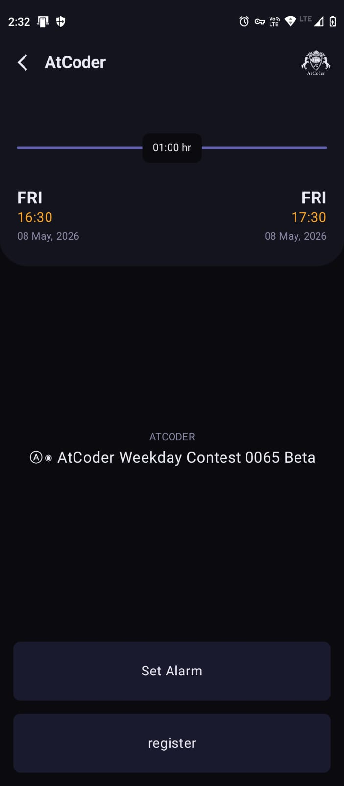
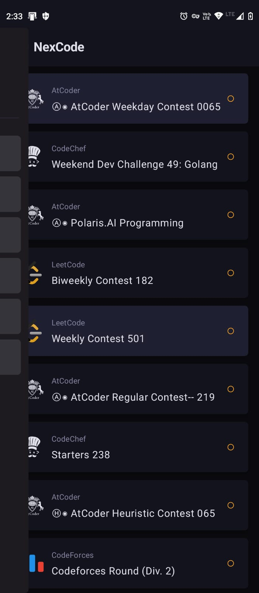
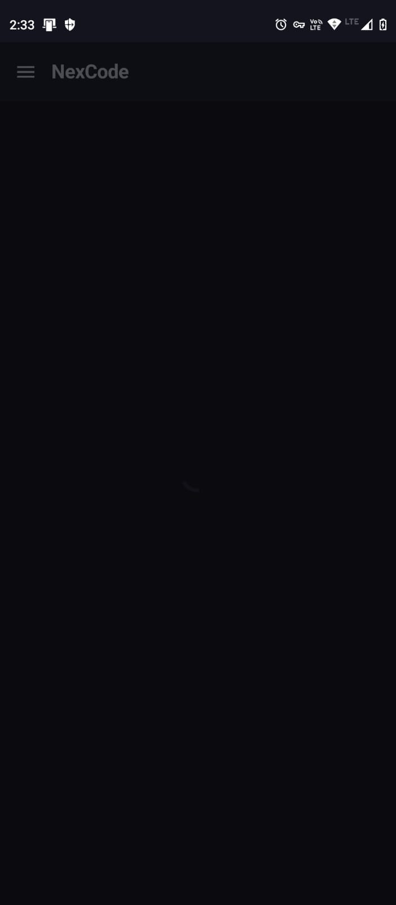
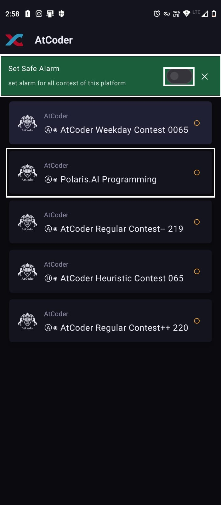

# NexCode
Automating reminder of contest, without opening the app again.
The Contest Data Comes From [ContestApi](https://github.com/Distracted-Explorer/contest-api) GitHub Repo
> I made it using agile method so there are issues with in documentation 

##  Introduction
It is a Contest Aggregator app which looks through different websites like Leetcode, Codeforces and bring all the contest together.
You can set alarms in it for upcoming contests or set default alarms for platforms and not worry about forgetting about them and you need not set them again. Or need to open the same exact app.

## Things Not To Do
### Bug
- When moving from one page to another (Coming back from another page).
- And If you are at the HomePage.
- Do not open the drawer if the homePage has not materialized completely.
Following these steps very fast will cause the app to endup in a infinite loop and it will not respond but will work if you open the app again after removing it from active apps.
1. 
2. 
3. 

**OR**

1. 
2. 
3. 

### If you know and wish to help with this error

#### Navigation
One of the navigation for platform page to navigation page
~~~
// Platform Specific View: Shows contests for a single platform (e.g., LeetCode).  
composable("platform") {  
  PlatformPage(  
        viewModel,  
        navController,  
        navigateToContestPage = {contest ->  
  viewModel.setSelectedContest(contest)  
            viewModel.markVisited(contest.name)  
            navController.navigate("contest")  
        }  
  )  
}
~~~
#### ViewModel
~~~
	var selectedPlatform: String? = null
~~~

#### Platform Page
~~~
val platformName=viewModel.selectedPlatform
//later in code for moving back
windowInsets = WindowInsets(0),  
navigationIcon = {  
  IconButton(  
        onClick = {  
  viewModel.selectedPlatform=null  
  navController.popBackStack()  
        }  
  ) {  
  Icon(  
            painter = painterResource(R.drawable.logo),  
            contentDescription = "Back",  
            tint = null  
  )  
    }  
}
~~~
