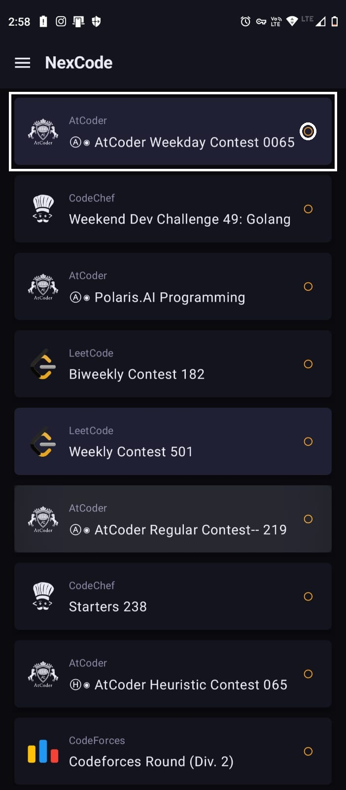
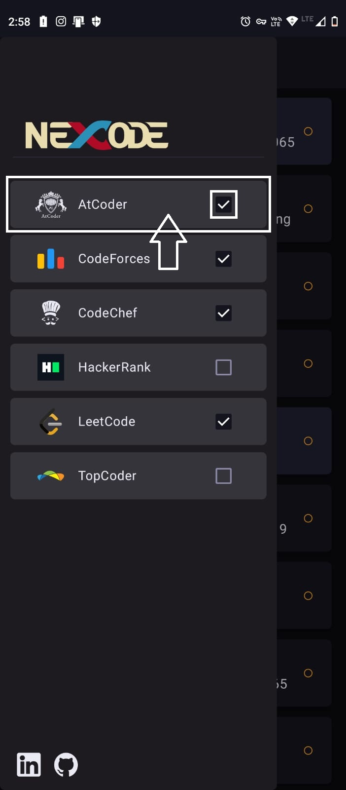
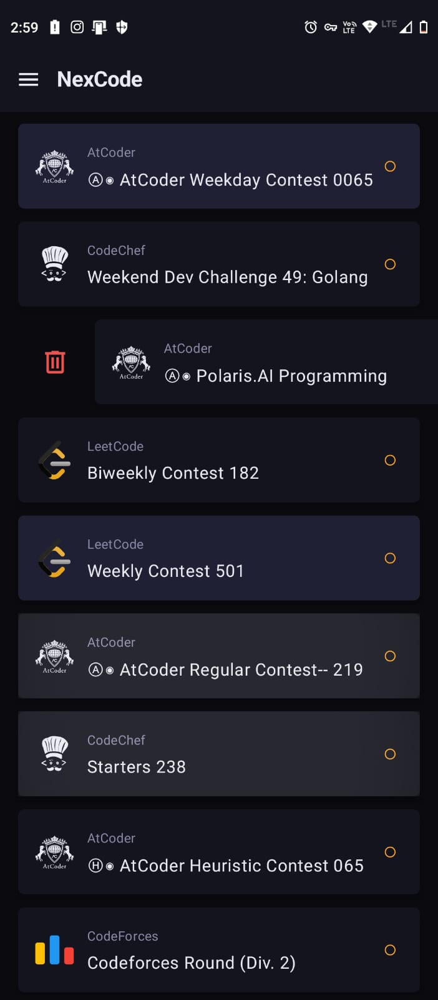
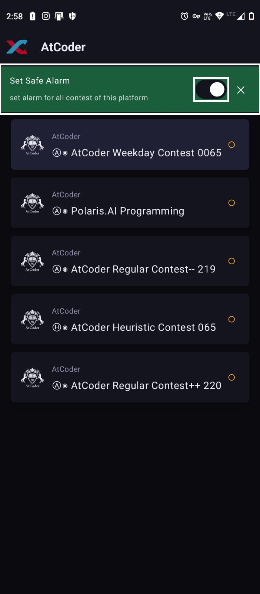
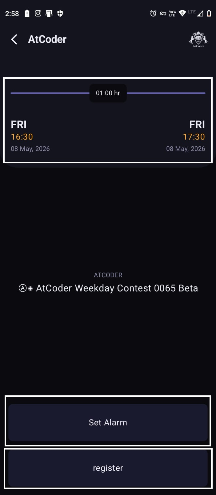
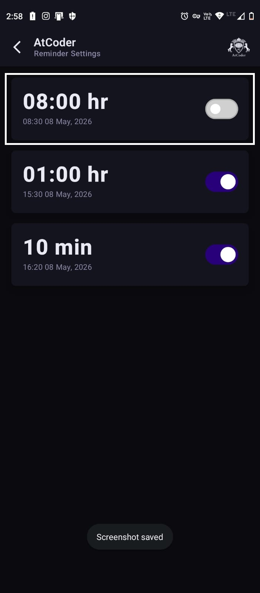
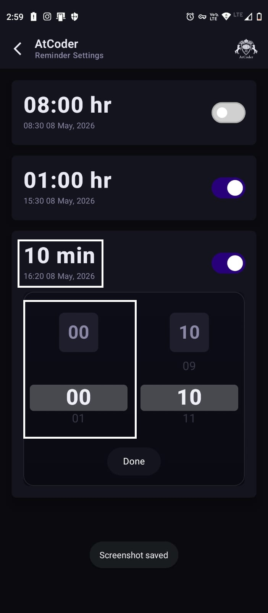

# UserGuide
## The HomePage

shows list of upcoming contest Green Circle represent Running Contest while Yellow Circle representing upcoming contest in sorted order and contest of past 3 days are represented with red circle. You can delete the contest from the list and remove it alarm notification all together.
  

You can use Menu to filter the contests which will be shown in homepage, or open the specific platform page by clicking on the platform card in menu.

## The Platform Page

You can set Automatic safe Alarms for all contest of that platform currently available or upcoming. Safe Alarms are **8hr** before contest and **1hr** before contest **10min** before contest Safe stating it will not ring in between 10pm to 7am(considering night time), Alarm will be adjusted accordingly to 10pm of previous day or 7am of next day.

## The Contest Page

The Contest Page represents time and date of contest, name, and progress of how far the contest has proceeded.
You can move to Alarm Page to set custom Alarms and to registration page to register to said contest.

## The Alarm Page

You can set custom Alarms for contest individually.